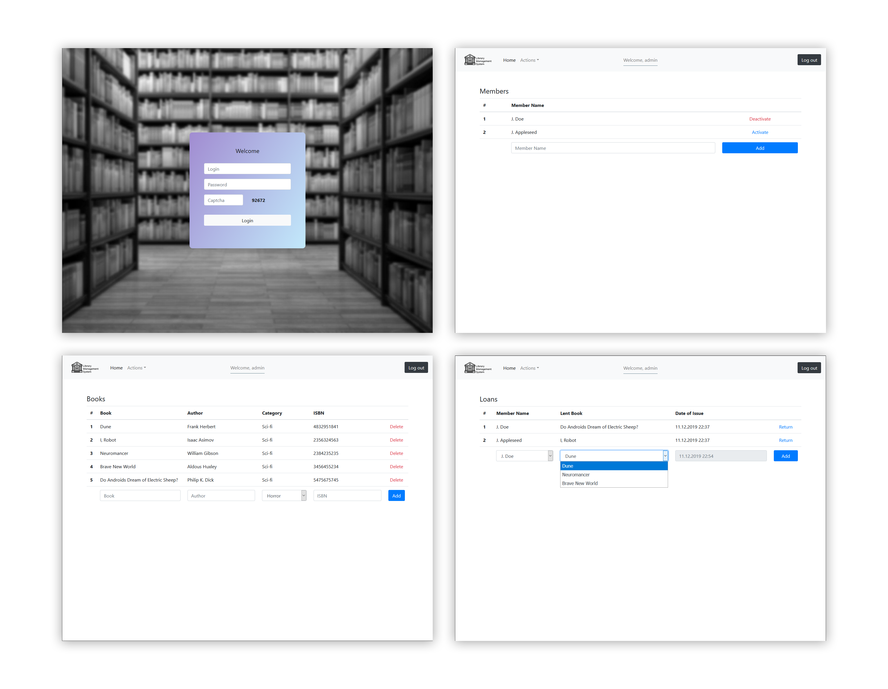

[](https://www.github.com/ozencb/Library-Management-System/issues)
[](https://github.com/Ozencb/library-management-system)
[](https://github.com/Ozencb/library-management-system)
[](../master/LICENSE)

# 📚 Library Management System

A simple library management system with PHP and MySQL.
This is a school project so it lacks most of the features that a fully-fledged management system might have. Everything is kept at a very basic level. So, I reckon, it will not be used by anyone.



## Features
* A login page with captcha
* Dashboard
* Book management
* Member management
* Borrowed Books

## Installation

Copy the project folder to your preferred Apache server's host folder.
For Xampp, I use ```htdocs```.

You can then import the ```library_db.sql``` script or run it as a query which should create the database and insert some data. 

After checking and adjusting ports and login info on ```config.php``` you should be ready to launch the project.

Login credentials are ```admin``` and ```admin```.
